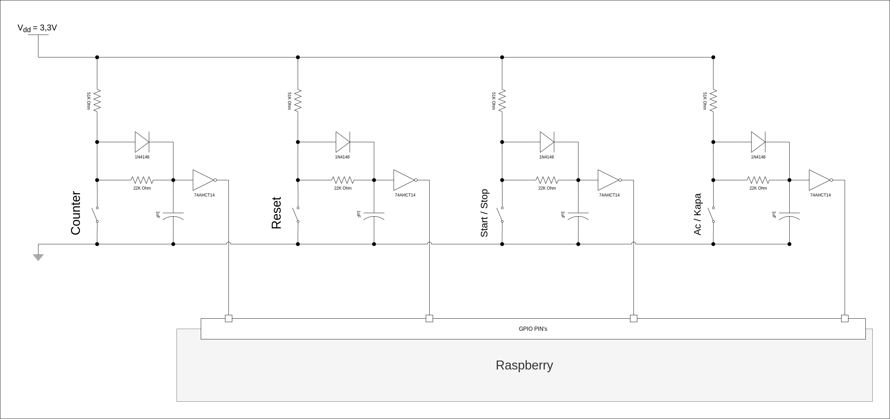

# cesit_dijitallesme

# Install

## Raspbian OS

## Python

# Configure

## App Service
```
sudo cp conf/cesit_core.service /etc/systemd/system/
sudo systemclt enable cesit_core.service
sudo systemclt start cesit_core.service
```

## VPN
Copy and give vpn-login information with ```nano```.
```
sudo cp myconnection.conf /etc/vpnc/
sudo nano /etc/vpnc/myconnection.conf

sudo cp conf/vpnc@.service /lib/systemd/system/vpnc@.service
sudo systemclt enable vpnc@myconnection.service
sudo systemclt start vpnc@myconnection.service
```

# Requirements
- ```pip3 install pymongo RPLCD smbus2 ```
- ```pip3 install "paho-mqtt<2.0.0"```

# Hardware

## Pinout

imgref: indibit.de
## Input Circuit


# Remarks
- An external pull-up sensor is being used.
If an internal pull-up must be used, the entry `pull_up_down=GPIO.PUD_OFF` in `button_switch.py` within the line `GPIO.setup(self.gpio_no, GPIO.IN, pull_up_down=GPIO.PUD_OFF)` needs to be removed.
- A hex inverter is used before the GPIO input, so the signals are inverted.
- Currently, a 1 microfarad capacitor is installed for debouncing, which is very large. Either remove it or replace it with a 0.1 microfarad capacitor.
